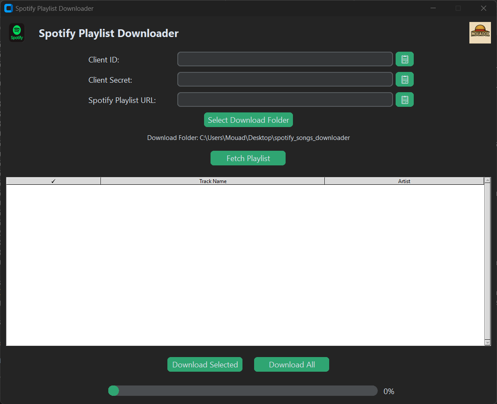
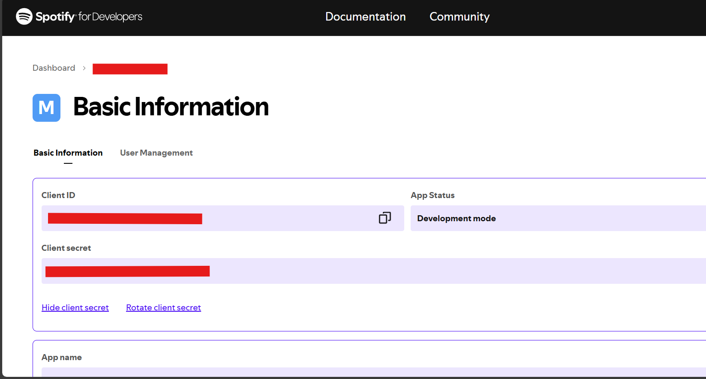

# 🎵 Spotify Playlist Downloader (Modern Tkinter GUI)

A **modern, ergonomic Spotify Playlist Downloader** built with Python and Modern Tkinter.  
Easily extract, select, and download songs from your Spotify playlists with a sleek interface.

---

## ✨ Key Features
- 🎯 **Paste Spotify playlist link** with a one-click **Paste** button  
- 📄 **Artist name display** in a clean, scrollable table  
- ☑️ **Checkbox selection** for multiple songs  
- 📂 **Custom download folder** selection  
- 📊 **Real-time download progress bar** with percentage  
- 🎨 **Modern Tkinter UI theme** for a smooth user experience  
- 🖼 **Logos in the header** (Spotify + your own)  
- 🖱 **Scroll support** for large playlists  

---

## 📸 Screenshots
  
  

---

## 🛠 Installation

### 1. Set up Spotify API
1. Go to the **[Spotify Developer Dashboard](https://developer.spotify.com/dashboard/)**  
2. Create a new app to get your **Client ID** and **Client Secret**

### 2. Install Dependencies
Make sure you have Python 3.8+ installed, then:
```bash
pip install -r requirements.txt
```

---

## ▶ Usage
Run the application:
```bash
python spotify_gui_downloader.py
```

**Steps:**
1. Paste your Spotify playlist link  
2. Enter your **Client ID** and **Client Secret**  
3. Click **Extract Songs**  
4. Select desired songs via checkboxes  
5. Choose a download folder  
6. Click **Download Selected** or **Download All**  

---

## 🖥 Build as EXE (Windows)
1. Install **PyInstaller**:
```bash
pip install pyinstaller
```
2. Create the executable:
```bash
pyinstaller --onefile --noconsole spotify_gui_downloader.py
```
3. The `.exe` file will be in the `dist/` folder.

---

## 📜 Requirements
- Python **3.8+**
- All dependencies listed in `requirements.txt`

---

## ❤️ Credits
- **Developed by:** Mouadox  
- **Spotify API:** [Spotipy](https://spotipy.readthedocs.io/)  
- **YouTube Downloads:** [yt-dlp](https://github.com/yt-dlp/yt-dlp)  
